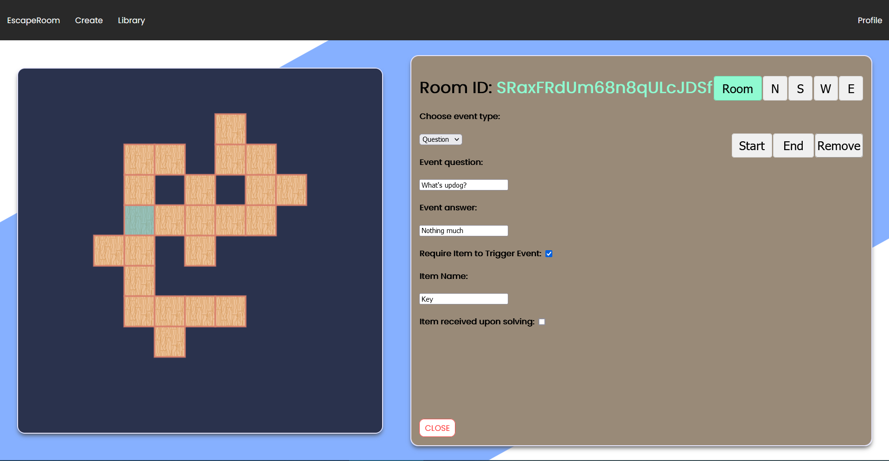
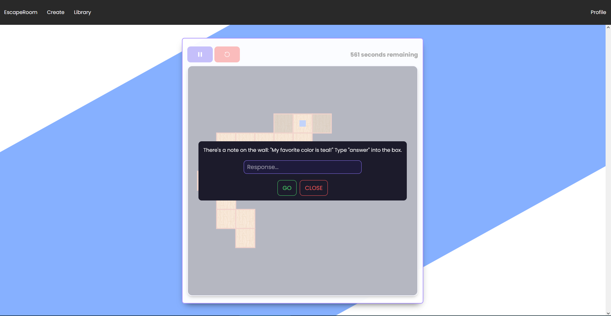
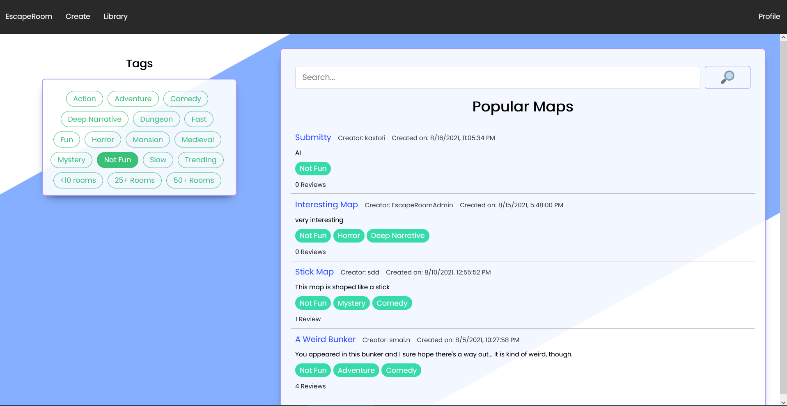

# Escape Room Maker

The Escape Room Maker is a comprehensive solution for creating, distributing, and playing custom tile-based puzzle environments. Users will have access to a map creation interface where they can design a maze filled with puzzles that players will need to navigate and escape from. The maps will be publishable to a library of the community’s previously created maps which can be explored and played.

People stuck at home during quarantine need other sources of entertainment as actual real-life escape rooms are not operational during quarantine, and people are missing an aspect of these intellectually stimulating activities as well as a community for sharing the maps.
The solution is the online Escape Room Maker, so users can do all these things in one from the comfort of their room.

Users will be able to create accounts and log in to access the main features of the software such as creating maps and favoriting other people’s maps. The software will include a comprehensive user interface for designing the layout of the map, adding storylines and puzzles to each room, and publishing the finalized, playable map. The map library will be an online source for browsing and discovering maps made by other players. This will include search capabilities, filters, user ratings, and favorites. The site will also include a space on-site for users to play levels that they find in the map library.

## Contributors

- James Crovo
- Andrew L’Italien
- Samantha Neumann
- Aiden Sullivan
- Heng-Min Tan

## Development Schedule

- Sprint 0 (06/03/2021 - 06/10/2021):
  - Get details of project organized, have a clear plan of what the end project will look like and entail - 3 hours
- Sprint 1 (06/10/2021 - 06/17/2021):
  - Have all members set up in the development environment including database, web server, development client server, and added as a contributor in the git   - repository - 2 days
  - Start writing the type-interfaces for user and map types based on discussion  - 1 day
  - Write a user story sample -  1 day
  - Write a style guide - 1 day
  - Visual prototype of the website - 1 day
- Sprint 2 (06/17/2021 - 06/24/2021):
  - Create database tables for storing users and maps - 1 day
  - Start on creation page - 3 days
    - Map title/ description - 1 day
    - Main grid on left for activating/ deactivating rooms - 1 day
      - Clicking on a grid cell brings up the room info editor
  - Continue writing user stories - 1 day
- Sprint 3 (06/24/2021 - 07/01/2021):
  - Create splash page, login/registration page - 2 days
  - Continue working on the creation page - 2 days
  - Start on map library page - 2 days
    - Create the basic page layout
    - Display some maps, not necessarily pulled from the database
  - Make slides demonstrating unimplemented features (included in mockup) - 1 day
  - Compile all user stories written so far - 1 day
- Sprint 4 (07/01/2021 - 07/08/2021):
  - Start creating the map-playing interface - 3 days
    - Takes in map data from web server, renders it in a playable way
- Sprint 5 (07/08/2021 - 07/15/2021):
  - Write web server endpoints for interacting with database, creating accounts, logging in, creating a map, retrieving a map - 3 days
- Sprint 6 (07/15/2021 - 07/22/2021):
  - (break)
- Sprint 7 (07/22/2021 - 07/29/2021):
  - Make creating maps login-only - 1 day
  - Finishing up the map-playing interface, should work from beginning to end of a map - 4 days
  - Make the library page functional, add search, filters, bookmarks - 2 days
- Sprint 8 (07/29/2021 - 08/05/2021):
  - Add bookmarks - 1 day
  - Add map validation, ratings, comments - 2 days
  - Add better style to the website - 3 days
  - Make registration/ login functional, add email verification and admin accounts 2fa - 2 days
  - Add administrative privileges for deleting maps and accounts - 2 days
- Interim Release (July 23):
  - Have basic website structure set up
    - Creation and Library pages
    - Home/ Landing page
    - Login/ Registration page
  - Have basic map creation tool set up
    - Interactable grid for mapping out the maze
    - Dialogues for inputting cell puzzles
  - Have basic website API endpoints set up
    - Account sessions
    - Getting/ setting map data